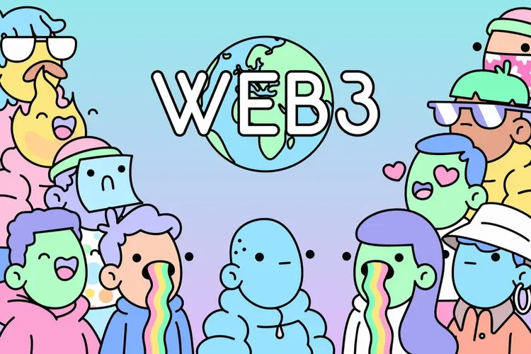

# Hey There👋, I'm Anish

#### I'm a 21 y/o Web3 Developer based in Nepal! I also write blogs sometimes, to be and will be rustacean and I love listening to music!

- 🔭 I’m currently working on Backend Development and web3.0  
- 🌱 I’m currently learning everything that i can 
- 📫 How to reach me: nativeanish@gmail.com and <a href="https://www.linkedin.com/in/anish-gupta-a08a6bbb/">Linkedin</a>  
- 😄 Pronouns: He/Him  
- ⚡ Fun fact: Music 🎧 is what that drives me!!  
- 🛒 Buy my NFTs, [MyNFTs](https://testnets.opensea.io/assets/goerli/0x0b3f212444b45a78a27fc02a539dc5257a37412d/8) 🤣
-  Wokring and learning on Near

## Skills 🚀

  

## Find me around the web 🌐

- [Twitter](https://twitter.com/nativeanish)
- [Github](https://github.com/nativeanish)
- [Linkedin](https://www.linkedin.com/in/anish-gupta-a08a6bbb/)
- [Blog](https://nativeanish.tech)
- [Facebook](https://www.facebook.com/nativeanish)

## My Projects 📁

- [**fastaid.me**](https://fastaid.me): The Blood Donation Camp run by me and my team. Completed 10K+ milistones.
- [**openquest**](https://github.com/CreatorOS/twitter-dapp/): Created a quest on how to create decentrazlied twitter on ethereum network with openquest startup.
- [**kalwartrade**](https://kalwartrade.com/): A decentralized exchange for clothing. (Deprecated)

## Work Experience 🥷

- Junior Technican at incredibleworld (2017)
- Junior Web Developer at hostelguider (2018-2019)
- React Developer at aspnaturalresources (2019-2020)
- Freelancer Web3 Developer (2020+)
- Contributor at ethers.js and fastify
- Teaching Rust at my own valley ❤️
- Life time volunteer of Red Cross Society 🩸
- Rover of World Organization of the Scout Movement and Nepal Scouts (First Class Rank)⚜️
- Instructor and First degree black belt 🥋

## Discord Status 💻

